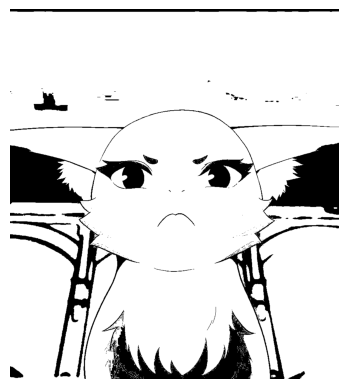

# Image Processing Algorithms
This repo contains the implementation of some basic image processing algorithms from scratch using python.  
This work was done during the "Introduction to Image Analysis" module.  
The code was based of the work of [Benjamin Perret](https://github.com/PerretB) that can be found on his [github](https://github.com/PerretB/ImageProcessingLab)  

# Basic Operations

### The inverse of an image:

### The threshold of an image:

### The quantization of an image:
#### number of nuances equals 2:

#### number of nuances equals 3:

#### number of nuances equals 5:

### The normalization of an image:

### The equalization of an image:

### The equalization of an image:

## Filters

### Mean Filter

### Median Filter

### Convolution
Use case "Laplace filter"  

### Sobel Filter

### Transpose

### Interpolation

#### Nearest neighbor interpolation

#### Bilinear interpolation

### Dilatation

### Erosion

### Open

### Close

### Morphological Gradient

